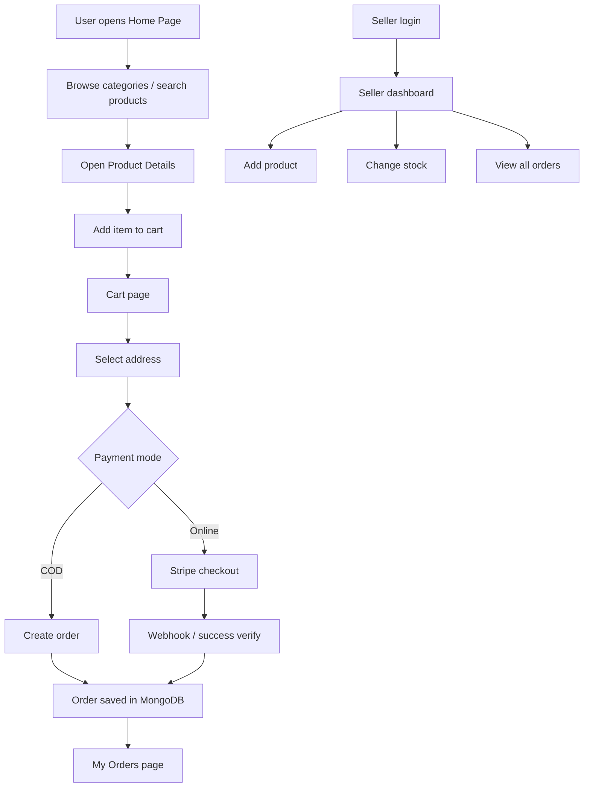

# Greencart / Groceryatnxtdoor Project Flow

This project is a full-stack grocery e-commerce app built with React on the frontend and Node.js, Express, and MongoDB on the backend. The main idea is simple: users browse products, add items to cart, save delivery addresses, and place orders, while sellers manage products and view orders from a separate dashboard.

## 1. High-Level Architecture

The app is split into two main parts:

- `client/`: React + Vite frontend
- `server/`: Express + MongoDB backend

Frontend state is centralized in `client/src/context/AppContex.jsx`, which stores the logged-in user, seller status, products, cart, search query, and helper actions like `addtoCart`, `updateCartItem`, and `getCartAmount`.

Backend routes are mounted in `server/server.js` and split by feature:

- `/api/user`
- `/api/seller`
- `/api/product`
- `/api/cart`
- `/api/address`
- `/api/order`

## 2. Frontend Flow

### App bootstrap

The app starts from `client/src/App.jsx`. It checks whether the current route contains `seller` and then decides whether to show the customer layout or the seller layout.

- Normal user pages show `Navbar` and `Footer`
- Seller pages use a separate `SellerLayout`
- `Login` is shown as a modal when `showUserLogin` is true

### Main user pages

The regular shopping flow is:

1. `Home` shows the banner, categories, bestsellers, bottom banner, and newsletter sections.
2. `AllProducts` lists all products and filters them by the search query stored in context.
3. `ProductCategory` filters products by category from the URL.
4. `ProductDetails` shows a single product, gallery images, description, related products, and add-to-cart / buy-now actions.
5. `Cart` shows selected products, quantity controls, address selection, payment selection, and order placement.
6. `AddAdress` lets the user save a shipping address.
7. `MyOrders` displays the current user’s past orders.

### Shared UI behavior

`Navbar` handles:

- Login/logout state
- Cart badge count
- Search input
- Mobile menu
- Navigation to products and orders

Search is client-side: typing in the navbar updates `searchQuery` in context, and `AllProducts` filters the product list locally.

## 3. Backend Flow

### Server setup

`server/server.js` does the following:

- Connects to MongoDB
- Connects to Cloudinary
- Configures CORS for local and deployed frontend URLs
- Uses a special raw body parser for the Stripe webhook route
- Mounts all feature routes
- Returns JSON errors from a global error handler

### Authentication flow

User auth is cookie-based JWT authentication.

- Register: `/api/user/register`
- Login: `/api/user/login`
- Check session: `/api/user/is-auth`
- Logout: `/api/user/logout`

On successful register or login, the backend:

- Hashes passwords with `bcryptjs`
- Signs a JWT with `jsonwebtoken`
- Stores the token in an HTTP-only cookie named `token`

Seller auth is separate and simpler.

- Seller login: `/api/seller/login`
- Seller auth check: `/api/seller/auth`
- Seller logout: `/api/seller/logout`

The seller panel uses an HTTP-only cookie named `sellerToken`.

## 4. Product Flow

Products are managed from the seller side and consumed by the user side.

### Seller product creation

In `client/src/Pages/seller/AddProduct.jsx`, the seller fills in:

- Product name
- Description
- Category
- Price
- Offer price
- Up to 4 images

The data is sent as `FormData` to `/api/product/add`.

### Backend product handling

In `server/controller/productcontroller.js`:

- Images are uploaded to Cloudinary
- Product data is saved in MongoDB
- Products are returned from `/api/product/list`
- A single product is returned from `/api/product/list/:id`
- Stock status can be toggled from `/api/product/change-stock`

### User product browsing

The frontend loads products into global context with `fetchProducts()`. That data powers:

- Home page bestsellers
- All products page
- Category pages
- Product details page
- Cart calculations

## 5. Cart Flow

The cart is maintained in frontend state and synchronized to the database.

### Add to cart

From `ProductDetails`, clicking Add to Cart or Buy Now calls `addtoCart(product._id)` from context.

That function:

- Clones the current cart object
- Increments the selected item quantity
- Sets `isLocalChange` to true
- Shows a toast message

### Cart sync to database

In `AppContex.jsx`, when a user is logged in and `cartItems` changes due to a user action, the frontend posts the cart to `/api/cart/update`.

The backend `updateCart` controller:

- Reads the authenticated user from the JWT middleware
- Replaces the stored cart with the incoming cart
- Cleans invalid or zero values
- Saves the cart inside the `User` document

### Cart display and totals

`Cart.jsx` converts `cartItems` into a list of product objects and calculates:

- Item count
- Subtotal
- Tax at 2%
- Total amount

Quantity updates and removals also update the shared context so the database stays in sync.

## 6. Address Flow

The shipping address is captured in `AddAdress.jsx` and sent to `/api/address/add`.

Address data is associated with the user and later fetched in `Cart.jsx` using `/api/address/get`.

The user can:

- Add a new address
- Select from saved addresses
- Continue to checkout using the selected address

## 7. Order Flow

The app supports two payment modes:

- Cash on Delivery
- Online payment through Stripe

### Cash on Delivery

When the user selects COD and clicks place order:

- `Cart.jsx` sends items and address to `/api/order/cod`
- The backend recomputes the amount from product data
- A new `Order` document is created
- The user’s cart is cleared in MongoDB
- The frontend navigates to `MyOrders`

### Stripe checkout

When the user selects online payment:

- `Cart.jsx` sends the order to `/api/order/stripe`
- The backend recomputes the amount again from product data
- An order record is created first
- Stripe Checkout session is generated
- The frontend redirects to Stripe using the returned session URL

### Payment confirmation

The project uses two Stripe confirmation paths:

- `GET /api/order/stripe/success` verifies the Stripe session
- `POST /api/order/stripe/webhook` handles Stripe webhook events

If payment is successful, the order is marked as paid and the user cart is cleared.

### Order viewing

- `MyOrders.jsx` calls `/api/order/user` for the current customer
- `seller/Orders.jsx` calls `/api/order/seller` for the seller dashboard

## 8. Database Model Flow

The main MongoDB models are:

- `User`: name, email, password, cartItems
- `Product`: name, description, price, offerPrice, images, category, inStock
- `Address`: userId, firstname, lastname, email, street, city, state, zip, country, phone
- `Order`: userId, items, amount, address, status, paymentType, isPaid

This structure is enough to support user login, cart persistence, delivery details, product browsing, and order tracking.

## 9. Seller Dashboard Flow

The seller area is isolated under `/seller` and wrapped by `SellerLayout`.

Seller pages include:

- Add Product
- Product List
- Orders

The sidebar in `SellerLayout` controls navigation, and the logout button clears the seller cookie and returns to the homepage.

The seller can:

1. Log in with admin credentials
2. Add new products with images
3. Toggle stock status in the product list
4. View customer orders

## 10. What To Say In An Interview

If you need a short explanation, say this:

"This is a MERN-based grocery e-commerce platform. The frontend is built in React with a shared context for auth, products, search, and cart state. The backend uses Express and MongoDB for authentication, product management, cart syncing, addresses, and orders. Users can browse products, search them, add them to cart, save addresses, and place COD or Stripe orders. Sellers have a separate dashboard to add products and manage inventory."

## 11. Strong Interview Points

- JWT-based authentication with HTTP-only cookies
- Centralized frontend state through React Context
- Stripe webhook support for payment confirmation
- Cloudinary image upload for products
- Cart synchronization between frontend and MongoDB
- Separate customer and seller flows
- Route-based separation for user and seller dashboards

## 12. Simple Flow Diagram

## 13. Notes For Revision

- Frontend entry: `client/src/App.jsx`
- Global state: `client/src/context/AppContex.jsx`
- Server entry: `server/server.js`
- User auth: `server/controller/userController.js`
- Cart sync: `server/controller/cartController.js`
- Orders and Stripe: `server/controller/orderController.js`
- Products and Cloudinary: `server/controller/productcontroller.js`
- Seller dashboard: `client/src/Pages/seller/SellerLayout.jsx`

This file should be enough to revise the project quickly before an interview and explain both the user journey and the seller journey end to end.